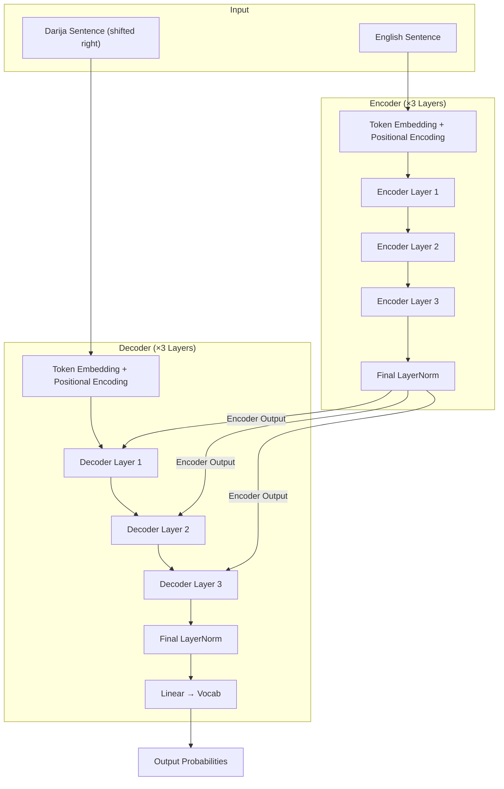
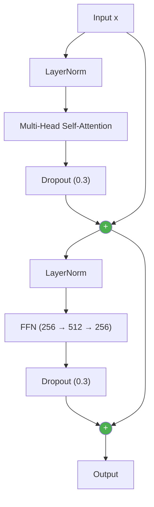
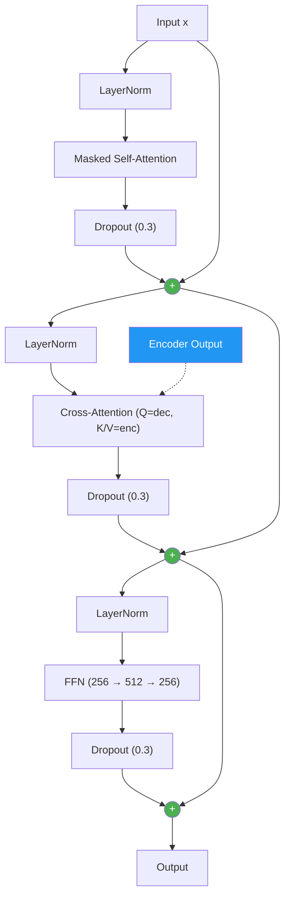
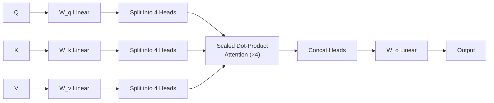
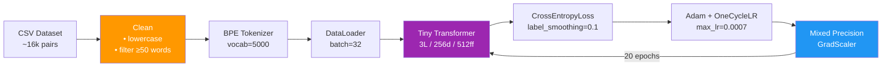
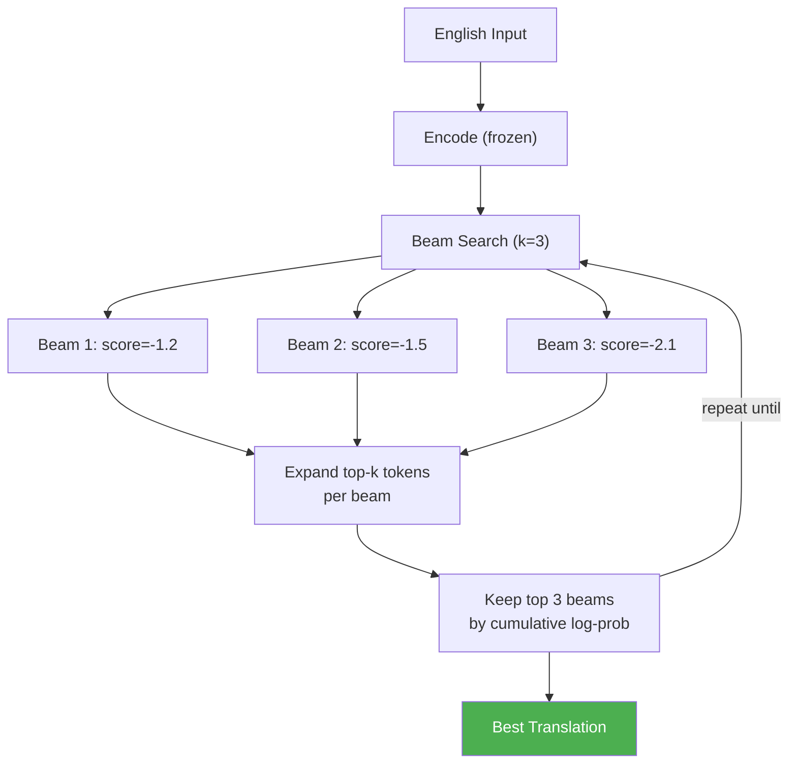

#  English → Darija Transformer

An **educational project** built from scratch to learn the Transformer architecture by implementing a lightweight English →  Darija translator, trained on ~16k sentence pairs.

> This is not a production translation system — it's a hands-on learning exercise to deeply understand how attention, positional encoding, encoder-decoder stacks, and beam search work together.

## Dataset

[**English-to-Moroccan-Darija**](https://huggingface.co/datasets/BounharAbdelaziz/English-to-Moroccan-Darija/tree/main/data) by BounharAbdelaziz on HuggingFace — ~16k parallel sentence pairs.

## References & Inspiration

- 📄 [Attention Is All You Need](https://arxiv.org/abs/1706.03762) — Vaswani et al., 2017 (the original Transformer paper)
- 🎥 [Coding a Transformer from Scratch](https://www.youtube.com/watch?v=eMlx5fFNoYc&t=1417s) — 3Blue1Brown

## Architecture Overview



## Encoder Layer (Pre-LN)



## Decoder Layer (Pre-LN)



## Multi-Head Attention



## Training Pipeline



## Inference: Beam Search



## Hyperparameters

| Parameter | Value |
|-----------|-------|
| `D_MODEL` | 256 |
| `D_FF` | 512 |
| `N_HEAD` | 4 (64 dims/head) |
| `NUM_LAYERS` | 3 |
| `dropout` | 0.3 |
| `VOCAB_SIZE` | 5000 (shared BPE) |
| `MAX_LEN` | 256 |
| LayerNorm | **Pre-LN** |

## Training Config

| Setting | Value |
|---------|-------|
| Optimizer | Adam (β₁=0.9, β₂=0.98) |
| Scheduler | OneCycleLR |
| `max_lr` | 0.0007 |
| `label_smoothing` | 0.1 |
| Epochs | 20 |
| Batch Size | 32 |
| Mixed Precision | FP16 via `torch.amp` |
| Gradient Clipping | 1.0 |

## Usage

1. Open `Transformer.ipynb` in **Google Colab** (T4 GPU)
2. Upload `train-00000-of-00001.csv` to the runtime
3. Run all cells sequentially (Cell 1 → 6)
4. Test translations in Cell 5:
```python
translate_beam("How are you?", model, tokenizer, device)
```

## Project Structure

```
├── Transformer.ipynb    # Main notebook (6 cells)
├── train-00000-of-00001.csv # English-Darija dataset (~16k rows)
├── tokenizer/              # Saved BPE tokenizer files
│   ├── vocab.json
│   └── merges.txt
├── checkpoint_epoch_*.pth  # Training checkpoints
└── README.md               # This file
```
